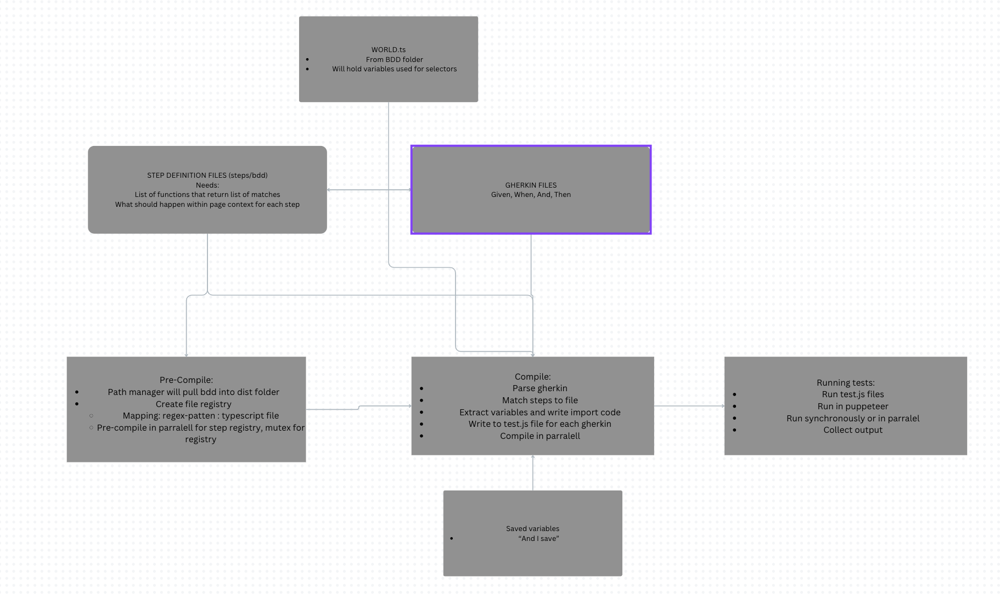

# GreenHouse 🌱

Currently in a rework

Will compile gherkin into test.js files to run in parralel browsers

New Flow:

TODO:

[ ] save to variables
[ ] use variables for selectors
[ ] cleanup compilation
[ ] config json
[ ] default definitions
[ ] wiki
[ ] save logs